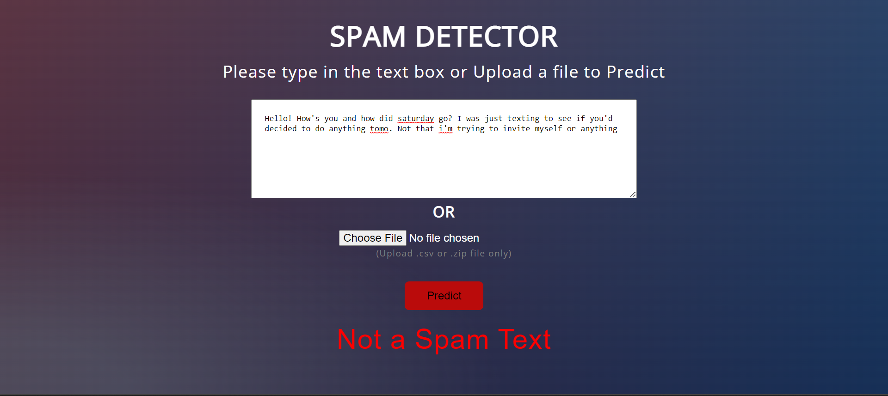
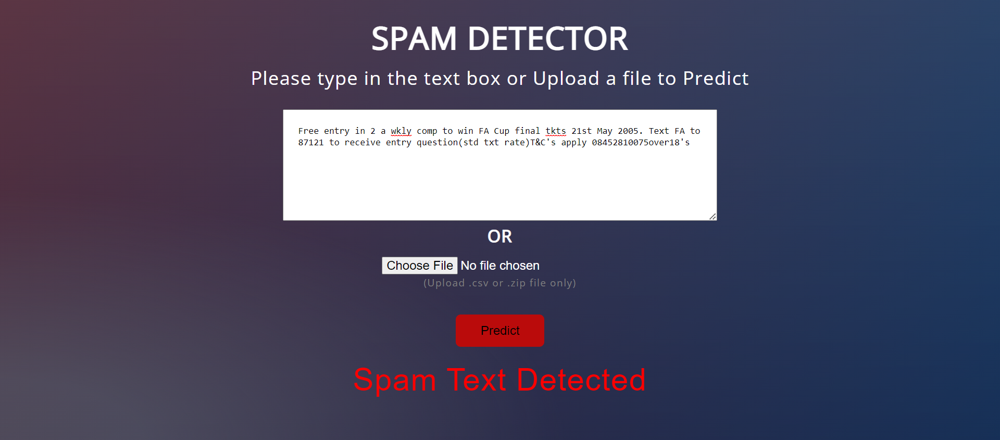
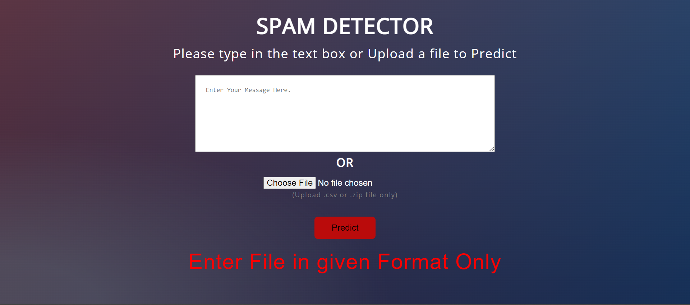
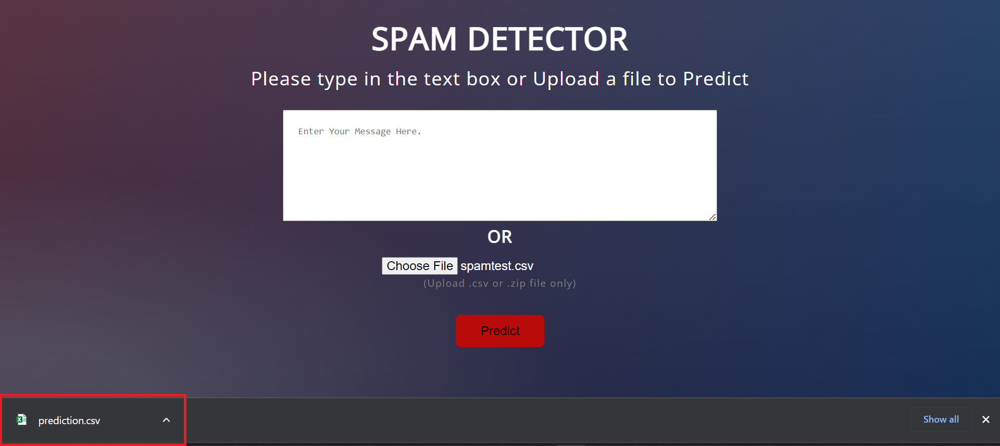

# Spam Detection Application
A Web Application which can predict the entered Text is Spam or Not.
User can also upload **.csv or .zip file** of texts for **Multiple Text Prediction**.

##### Deployed on onrender: <a href="https://spam-detection1.onrender.com/">Link</a>

### When entered Text is not Spam

### When entered Text is Spam

### When uploaded file is not in **.csv or .zip** format

### When a file is uploaded in correct format, the predicted output will be saved in a file named "prediction.csv".

